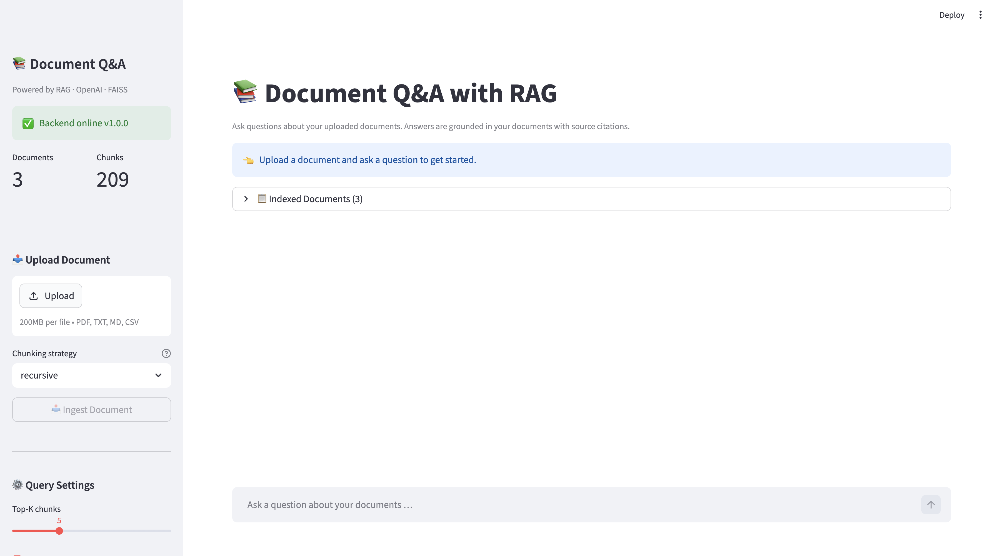

# Document Q&A with RAG

A production-grade document question-answering system powered by Retrieval-Augmented Generation. Upload PDF, TXT, Markdown, or CSV files, ask questions in natural language, and receive answers grounded in your documents with full source citations.

---

## Problem Statement

Large language models are prone to hallucination when asked questions that fall outside their training data. Fine-tuning on proprietary documents is expensive and requires retraining whenever the knowledge base changes. This project demonstrates how RAG can ground LLM responses in a user-controlled document corpus, producing accurate, cited answers without any model fine-tuning.

---

## Solution Approach

Documents are parsed, chunked, and embedded at upload time. At query time the user's question is embedded and semantically matched against the stored chunks using FAISS. The top-k most relevant passages are retrieved, optionally re-ranked for diversity using Maximal Marginal Relevance, and passed to the LLM as grounded context. If retrieval confidence falls below a threshold, the system declines to answer rather than hallucinate.

---

## Features

- **Multi-format ingestion** — PDF (PyMuPDF primary, pypdf fallback), TXT, Markdown, CSV
- **Three chunking strategies** — recursive (default), sentence, fixed-size
- **MMR re-ranking** — Maximal Marginal Relevance balances relevance with diversity to reduce repetitive sources
- **Jaccard deduplication** — near-identical overlapping chunks are removed before generation
- **Confidence scoring** — weighted score from top-3 chunk similarity; answers are withheld below threshold
- **Source citation cards** — every answer shows filename, page number, section, and relevance percentage
- **Multi-document scoping** — query all indexed documents or a selected subset
- **Document management** — upload, list, and delete indexed documents via API or UI
- **Q&A history** — full session history stored in SQLite with collapsible source cards in the UI
- **Streamlit frontend** — file upload sidebar, confidence meter, and expandable citation cards

---

## Tech Stack

| Layer | Technology |
|---|---|
| Backend API | FastAPI + Uvicorn |
| LLM | OpenAI GPT-4o-mini (via LangChain) |
| Embeddings | OpenAI text-embedding-3-small |
| Vector search | FAISS (faiss-cpu) — `IndexFlatIP` |
| PDF parsing | PyMuPDF (fitz) + pypdf fallback |
| Database | SQLite via SQLAlchemy Core |
| Configuration | Pydantic Settings |
| Frontend | Streamlit |
| Testing | pytest + pytest-asyncio + httpx |

---

## Architecture

```
STREAMLIT UI  (ui/app.py)
      │  HTTP
      ▼
FASTAPI BACKEND  (app/main.py)
  POST /api/v1/documents/upload    — parse, chunk, embed, index
  GET  /api/v1/documents           — list all indexed documents
  GET  /api/v1/documents/{doc_id}  — document metadata
  DELETE /api/v1/documents/{doc_id}— remove from index
  POST /api/v1/qa/ask              — retrieve + generate + cite
  GET  /api/v1/qa/history          — recent Q&A pairs
  GET  /health                     — system status

  RAGPipeline (rag_pipeline.py)
    Ingest path:
      ingest.py → parse file → chunk (recursive/sentence/fixed)
      embeddings.py → OpenAI batch embed → L2-normalise
      vector_store.py → add to FAISS IndexFlatIP → persist

    Query path:
      embed question → FAISS top-k search
      MMR re-rank (optional) → Jaccard deduplicate
      compute confidence score
      if confidence >= threshold → LLM with grounded prompt
      else → polite fallback (no generation)

DATA LAYER
  data/vector_store/    — FAISS index + metadata (auto-created)
  data/uploads/         — uploaded files (auto-created)
  data/sample_docs/     — three sample documents
  data/qa_history.db    — SQLite Q&A log
```

---

## Project Structure

```
Document Q&A with RAG/
├── app/
│   ├── __init__.py
│   ├── config.py         # Pydantic settings from .env
│   ├── models.py         # All Pydantic request / response schemas
│   ├── database.py       # SQLite via SQLAlchemy Core
│   ├── ingest.py         # Document parsing and chunking
│   ├── embeddings.py     # OpenAI embeddings with batching and retry
│   ├── vector_store.py   # FAISS index, MMR, persistence
│   ├── retriever.py      # Jaccard deduplication and confidence scoring
│   ├── prompts.py        # System prompts and context builder
│   ├── rag_pipeline.py   # Orchestrator — ingest and answer
│   └── main.py           # FastAPI app and all REST endpoints
├── ui/
│   └── app.py            # Streamlit frontend
├── data/
│   ├── sample_docs/
│   │   ├── rag_overview.md
│   │   ├── machine_learning_glossary.txt
│   │   └── openai_models_faq.csv
│   ├── uploads/          # Auto-created on first upload
│   └── vector_store/     # Auto-created on first ingest
├── tests/                # Planned — see Future Work
├── requirements.txt
└── README.md
```

---

## Setup Instructions

### Prerequisites

- Python 3.10+
- An OpenAI API key

### 1. Clone the repository

```bash
git clone <repo-url>
cd "Document Q&A with RAG"
```

### 2. Create and activate a virtual environment

```bash
python -m venv venv
source venv/bin/activate        # Windows: venv\Scripts\activate
```

### 3. Install dependencies

```bash
pip install -r requirements.txt
```

### 4. Configure environment variables

Create a `.env` file in the project root:

```env
OPENAI_API_KEY=sk-...

# Optional — defaults shown
CHAT_MODEL=gpt-4o-mini
EMBEDDING_MODEL=text-embedding-3-small
TOP_K=5
CHUNKING_STRATEGY=recursive
CHUNK_SIZE=800
CHUNK_OVERLAP=150
USE_MMR=true
MMR_DIVERSITY=0.3
MAX_FILE_SIZE_MB=50
TEMPERATURE=0.1
MAX_TOKENS=1024
CONFIDENCE_THRESHOLD=0.25
```

---

## How to Run

### Start the backend

```bash
uvicorn app.main:app --reload --port 8000
```

Interactive API docs at [http://localhost:8000/docs](http://localhost:8000/docs).

### Start the Streamlit frontend

```bash
streamlit run ui/app.py
```

Open [http://localhost:8501](http://localhost:8501) in your browser.

---

## Example Usage

### Upload a document

```bash
curl -X POST http://localhost:8000/api/v1/documents/upload \
  -F "file=@data/sample_docs/rag_overview.md" \
  -F "chunking_strategy=recursive"
```

### Ask a question

```bash
curl -X POST http://localhost:8000/api/v1/qa/ask \
  -H "Content-Type: application/json" \
  -d '{"question": "What is Maximal Marginal Relevance?", "top_k": 5, "use_mmr": true}'
```

**Sample questions for the included documents:**

- *"What is the difference between precision and recall?"*
- *"Which OpenAI embedding model is recommended for new projects?"*
- *"How does RAG differ from fine-tuning?"*

---

## Configuration Reference

| Variable | Default | Description |
|---|---|---|
| `OPENAI_API_KEY` | — | **Required.** OpenAI secret key |
| `CHAT_MODEL` | `gpt-4o-mini` | LLM for answer generation |
| `EMBEDDING_MODEL` | `text-embedding-3-small` | Embedding model |
| `TOP_K` | `5` | Chunks retrieved per query |
| `CHUNKING_STRATEGY` | `recursive` | `recursive`, `sentence`, or `fixed` |
| `CHUNK_SIZE` | `800` | Characters per chunk |
| `CHUNK_OVERLAP` | `150` | Overlap between consecutive chunks |
| `USE_MMR` | `true` | Enable MMR diversity re-ranking |
| `MMR_DIVERSITY` | `0.3` | MMR λ — 0 = max diversity, 1 = max relevance |
| `CONFIDENCE_THRESHOLD` | `0.25` | Minimum score to trigger LLM generation |
| `MAX_FILE_SIZE_MB` | `50` | Maximum upload size |

---

## Key Engineering Decisions

**FAISS `IndexFlatIP` with L2 normalisation** provides exact nearest-neighbour cosine similarity search with no approximation error. At the scale of a typical document corpus (tens of thousands of chunks), exact search is fast enough and avoids the operational complexity of a dedicated vector database.

**MMR re-ranking** addresses a known failure mode of pure top-k retrieval: when documents contain overlapping content, multiple retrieved chunks convey the same information. MMR uses a configurable λ parameter to trade off relevance against diversity, passing a richer range of evidence to the LLM.

**Jaccard deduplication** on the small candidate set (O(n²) over top-k × 3 candidates) removes near-identical passages from overlapping chunks before generation. This reduces token waste and prevents the LLM from producing repetitive answers.

**Confidence fallback** prevents the system from generating hallucinated responses when retrieved chunks are only weakly related to the query. A low similarity score is treated as a signal that the knowledge base does not contain the answer, and the user is prompted to upload relevant material.

**PyMuPDF with pypdf fallback** ensures PDF parsing succeeds even when the primary library is unavailable. Text is extracted page-by-page to preserve page number metadata used in citations.

---

## Limitations

- The FAISS index is held in memory and reloaded from disk at startup; very large indexes should use `IndexIVFFlat` or a managed vector database.
- Table extraction from PDFs is not supported. Complex table layouts are parsed as flat text, which may reduce retrieval accuracy for tabular content.
- Concurrent document uploads are not protected by a write lock; multi-worker deployments should add a lock around `VectorStore.add_documents()`.
- The confidence score is a similarity-based heuristic, not a calibrated probability.
- A formal test suite has not yet been implemented (see Future Work).

---

## Future Work

- Write unit and integration tests for `ingest.py`, `retriever.py`, and the RAG pipeline
- Add support for table extraction from PDFs using `pdfplumber` or `camelot`
- Implement streaming responses to reduce perceived generation latency
- Add a cross-encoder re-ranking step for improved retrieval precision
- Support user-defined document collections and access control

---

## Screenshots



---

## Author

**Samik Hafeez** — BSc Computer Science Portfolio Project  
This project demonstrates retrieval-augmented generation, vector search, and production FastAPI design applied to document intelligence.
